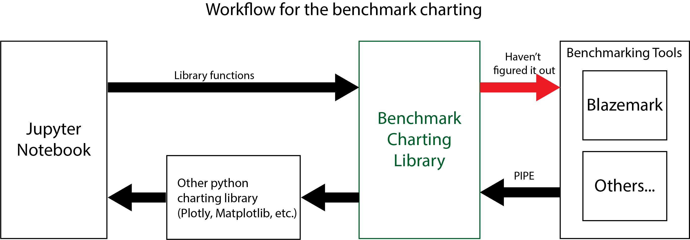
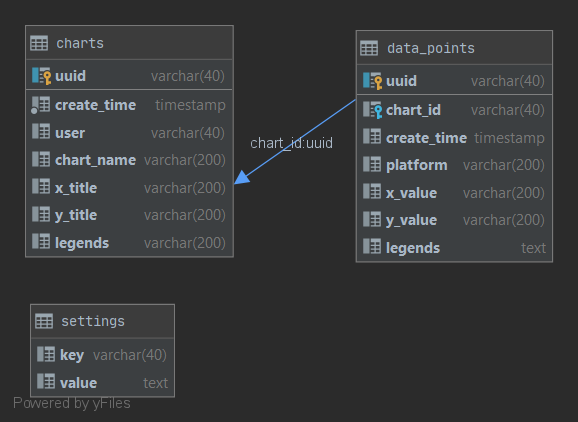

### Why would anyone use this tool

- Integrated benchmark run
- data share (sqlite3 is most common and favorite among data analyst)
- Jupyter integration
- Written as a python library
- Convenience
- Possibility of using cloud based PAAS (TAAC, AGAVE, etc.) for benchmark run.*

\* Not sure about this. Do we really need to add this as a feature?

### Assumptions

- User has prior experience with Jupyter notebook, python, and sqlite3.
- User has prior knowledge of python charting libraries like plotly, matplotlib, etc.
- Benchmarking tools should be preconfigured. Just need to provide the directory of the executable file and relevant command line argument parameters. (Right
 now, only testing with [blazemark](https://bitbucket.org/blaze-lib/blaze/wiki/Blazemark) using [HPX](https://github.com/STEllAR-GROUP/hpx) as backend.)
- This tool only supports chart types having data points in 2-D axis for a set of legends. (Line-chart, scatter-plot, bar-chart, etc.)

### Workflow

### Database Design

- The `charts` table will hold the information for a specific chart (its name, create date, who created it, x-title, y-title, and legends).
- The `data_points` table will hold the information for a specific data point of a chart. A foreign key indexing has been used to identify the relationship
 between the data-point and the chart. (Specifically which chart a datapoint belongs to)
- The `settings` table will hold additional static and global parameters in key-value format.
- The `legends` column in `charts` table will hold string of comma separated legend title. (Example: `key1, key2, key3`)
- The `legends` column in `data_points` table will hold JSON string. (Example: `{key1:value, key2:vaule2, key3:value3}`)
- The `platform` column will hold the name of a specific benchmark tool. During a benchmark run for a row in `data_points`, it will first find the platform
 name from this column, and then, find the executable file location from the settings table, and then it will run that executable file with the values of
  this row.  

----

### Conceptions

- Let users define multiple parameters, and their value range. Automatically generate all possible combination of parameter list.
- Create a new table with unique id for a set of parameters and measurements.
- parameters and measurements should be provided as a list of {name: values}, here values should also be a list containing a set of values for that
 parameters names.
- no need to store range information, It can be retrieved later from the new table.
- Store measurement flag in an integer value (1 for measurement, 0 for parameter). upto 64 parameters information can be stored in this fashion. if needed more
, an array of
 integer values could be used. (stored `m_flag` column in `benchmark_log` table)
- Ordering for this flag is as they appear in the parameters list.
- Create a new table *benchmark_log* which will hold columns (uuid, create_time, user, m_flag, table_id). Here *table_id* is the newly generated table id. 