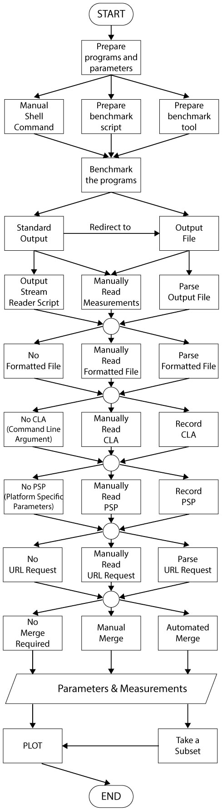

# Benchmark Run Scenarios

This flowchart captures choices implicit in the model described later in this document:

These scenarios describe how data is collected to perform performance comparisons. We first discuss the choices in collecting performance data. We then
 present a flow chart of the process, using these choices. Finally, we describe a subset of paths through the flow chart, as example scenarios.

  * [Choices in collecting performance data](https://github.com/sayefsakin/benchmark_charting/blob/master/benchmark_run_scenarios.md#Choices-in-collecting-performance-data)
  * [Model of Performance Data Collection](https://github.com/sayefsakin/benchmark_charting/blob/master/benchmark_run_scenarios.md#Model-of-Performance-Data-Collection)
  * [Example Scenarios](https://github.com/sayefsakin/benchmark_charting/blob/master/benchmark_run_scenarios.md#Example-Scenarios)

### Choices in collecting performance data

We divide the choices in collection to the comparison target, the method of collection, and the data collected.

#### What is being compared (Target)

The target of comparison could be at different granularities, within the same program external to it, such as:

* Function
* Library
* Executable file

#### How to compare (Mechanism)

To compare performance, one might utilize a performance measurement tool or write custom script to automate the performance gathering process. The tool or
 script can modify a set of parameters used to execute the target. Thus, the choices are:

* Manually running each configuration
* Writing a script to change parameters and run each configuration
* Running a performance measurement tool/program

#### Parameters and their sources (Data)
 
 * Formatted File - various files we can parse for data or metadate of interest
   1. Source code (Variable value, object property, comment or default value in the markup)
   2. File with fixed arbitrary metadata (CSV, JSON, XML, etc.)
   3. File with adhoc arbitrary metadata, (python pickle file)
   4. Metadata of any 3rd party tool (cell metadata of Jupyter Notebook),
   5. Configuration file
   6. Predefined database file (mysql, sqlite, postgre sql, etc.), both parameters stored therein and information about the db 
   7. Log data file, such as server logs, error logs, and tool logs 
   8. Parameters stored from a previous run 
   9. Document editor files (PDF, MSDoc, Google doc, etc.), for example, if parameters come from an old report
 * Command Line Arguments (CLA)
 * Platform Specific Parameters (PSP)
   1. Environment Variables
   2. Hardware Information
   3. System Information

### Model of Performance Data Collection

We model performance data collection as follows:

A. Execution 
  1. Prepare targets (programs) and the configurations in which they vary (e.g., problem size, number of processes).
  2. Prepare performance collection mechanism
  3. Run the mechanism
  4. Data is generated and output
  
B. Collection of Data & Metadata
  1. Collate in-memory data
  2. Collate output file data
  3. Collate command line arguments used
  4. Collate platform specific data
  5. Collate URL request data
  6. Merge collated data to single file/directory/database
  
C. Analysis
  1. Filter/plot/run other tools

### Example Scenarios

Table of Contents
* Simple Manual Collection, Single File
  * [Scenario 0 (Analyse Performance of Function Manually)](https://github.com/sayefsakin/benchmark_charting/blob/master/benchmark_run_scenarios.md#scenario-0-analyse-performance-of-function-manually)
  * [Scenario 1 (Analyse Performance of Library Manually)](https://github.com/sayefsakin/benchmark_charting/blob/master/benchmark_run_scenarios.md#scenario-1-analyse-performance-of-library-manually)
* Comparing Executables
  * [Scenario 2 (Analyse Performance of Executable File Manually)](https://github.com/sayefsakin/benchmark_charting/blob/master/benchmark_run_scenarios.md#scenario-2-analyse-performance-of-executable-file-manually)
  * [Scenario 3 (Analyse Performance of Executable File Automatically)](https://github.com/sayefsakin/benchmark_charting/blob/master/benchmark_run_scenarios.md#scenario-3-analyse-performance-of-executable-file-automatically)
  * [Scenario 4 (Manually Analyse Performance of Executable File with Output File)](https://github.com/sayefsakin/benchmark_charting/blob/master/benchmark_run_scenarios.md#scenario-4-manually-analyse-performance-of-executable-file-with-output-file)
  * [Scenario 5 (Manually Analyse Performance of Executable File with Output File Parser)](https://github.com/sayefsakin/benchmark_charting/blob/master/benchmark_run_scenarios.md#scenario-5-manually-analyse-performance-of-executable-file-with-output-file-parser)
  * [Scenario 6 (Automatically Analyse Performance of Executable File with Output File)](https://github.com/sayefsakin/benchmark_charting/blob/master/benchmark_run_scenarios.md#scenario-6-automatically-analyse-performance-of-executable-file-with-output-file)
  * [Scenario 7 (Automatically Analyse Performance of Executable File with Input and Output File)](https://github.com/sayefsakin/benchmark_charting/blob/master/benchmark_run_scenarios.md#scenario-7-automatically-analyse-performance-of-executable-file-with-input-and-output-file)
  * [Scenario 8 (Automatically Analyse Performance of Executable File with Input File)](https://github.com/sayefsakin/benchmark_charting/blob/master/benchmark_run_scenarios.md#scenario-8-automatically-analyse-performance-of-executable-file-with-input-file)
  * [Scenario 9 (Manually Analyse Performance of Executable File with Input File)](https://github.com/sayefsakin/benchmark_charting/blob/master/benchmark_run_scenarios.md#scenario-9-manually-analyse-performance-of-executable-file-with-input-file)
* Data Obtained Through URL
  * [Scenario 10 (Manually Analyse Performance of Executable URL)](https://github.com/sayefsakin/benchmark_charting/blob/master/benchmark_run_scenarios.md#scenario-10-manually-analyse-performance-of-executable-url)
  * [Scenario 11 (Manually Analyse Performance of Executable URL with Output File)](https://github.com/sayefsakin/benchmark_charting/blob/master/benchmark_run_scenarios.md#scenario-11-manually-analyse-performance-of-executable-url-with-output-file)
* Using an Existing Performance Measurement Tool
  * [Scenario 12 (Manually Analyse Performance of Executable File with Performance Measurement Tool)](https://github.com/sayefsakin/benchmark_charting/blob/master/benchmark_run_scenarios.md#scenario-12-manually-analyse-performance-of-executable-file-with-performance-measurement-tool)
  * [Scenario 13 (Manually Analyse Performance of Executable File with Performance Measurement Tool and Input File)](https://github.com/sayefsakin/benchmark_charting/blob/master/benchmark_run_scenarios.md#scenario-13-manually-analyse-performance-of-executable-file-with-performance-measurement-tool-and-input-file)
  * [Scenario 14 (Automatically Analyse Performance of Executable File with Performance Measurement Tool and Input File)](https://github.com/sayefsakin/benchmark_charting/blob/master/benchmark_run_scenarios.md#scenario-14-automatically-analyse-performance-of-executable-file-with-performance-measurement-tool-and-input-file)
  * [Scenario 15 (Automatically Analyse Performance of Executable File with Performance Measurement Tool, Input and Output File)](https://github.com/sayefsakin/benchmark_charting/blob/master/benchmark_run_scenarios.md#scenario-15-automatically-analyse-performance-of-executable-file-with-performance-measurement-tool-input-and-output-file)
* Collecting Data from Multiple Machines
  * [Scenario 16 (Manually Analyse Performance in Multiple Machines)](https://github.com/sayefsakin/benchmark_charting/blob/master/benchmark_run_scenarios.md#scenario-16-manually-measure-performance-in-multiple-machines)
  * [Scenario 17 (Automatically Analyse Performance in Multiple Machines)](https://github.com/sayefsakin/benchmark_charting/blob/master/benchmark_run_scenarios.md#scenario-17-automatically-measure-performance-in-multiple-machines)
  * [Scenario 18 (Automatically Analyse Performance in Multiple Machines with Multiple Performance Measurement Tools and Input Files)](https://github.com/sayefsakin/benchmark_charting/blob/master/benchmark_run_scenarios.md#scenario-18-automatically-analyse-performance-in-multiple-machines-with-multiple-performance-measurement-tools-and-input-files)
* More Parameters and Measurements
  * [Scenario 19 (Same parameter values and Same measurement type(s))](https://github.com/sayefsakin/benchmark_charting/blob/master/benchmark_run_scenarios.md#scenario-19-same-parameter-values-and-same-measurement-types)
  * [Scenario 20 (Same parameter values and new measurement type(s))](https://github.com/sayefsakin/benchmark_charting/blob/master/benchmark_run_scenarios.md#scenario-20-same-parameter-values-and-new-measurement-types)
  * [Scenario 21 (Additional parameter values and same measurement type(s))](https://github.com/sayefsakin/benchmark_charting/blob/master/benchmark_run_scenarios.md#scenario-21-additional-parameter-values-and-same-measurement-types)
  * [Scenario 22 (New parameter type(s) and same measurement type(s))](https://github.com/sayefsakin/benchmark_charting/blob/master/benchmark_run_scenarios.md#scenario-22-new-parameter-types-and-same-measurement-types)
  * [Scenario 23 (New parameter and measurement type(s))](https://github.com/sayefsakin/benchmark_charting/blob/master/benchmark_run_scenarios.md#scenario-23-new-parameter-and-measurement-types)
  * [Scenario 24 (Subset of the data)](https://github.com/sayefsakin/benchmark_charting/blob/master/benchmark_run_scenarios.md#scenario-24-subset-of-the-data)

### Scenario 0 (Analyse Performance of Function Manually)

##### Prepare functions and parameters:

Let’s consider, for a specific task, a programmer, named Robin, wrote a cool new function called `Perfecto` into her C++ program. She wants to measure its performance and compare that with two other similar functions — `Obsoleto` and `Coolio` — for the exact same task. Let’s consider again these functions take 3 parameters— param1, param2, param3. Robin wants to measure the execution time all three functions given the parameters. For example, if the task is to compute matrix multiplication, then a parameter could be the matrix size.

##### Write a measurement script for functions:

Robin writes a performance measurement script. In the script, she initializes the 3 parameters and passes them to the function `Perfecto` as parameters. She measures time before and after calling that function by using the `clock()` function, and then takes the difference to measure the execution time. She prints out the measurement value to standard output. She does the exact same steps with the other two functions `Obsoleto` and `Coolio`. These are summarized in the following code snippet.

    #include <ctime>
    void Perfecto(double a, double b, double c) {
        /* body of the function */
    }
    ...
    void Obsoleto(double a, double b, double c) {
        /* body of the function */
    }
    ...
    void Coolio(double a, double b, double c) {
       /* body of the function */
    }
    ...
    double param1 = 42.0, param2 = 3.14, param3 = 1.61;
    clock_t time1, time2, time3, time4;
    double cpu_time_used;

    time1 = clock();
    Perfecto(param1, param2, param3);
    time2 = clock();
    Obsoleto(param1, param2, param3);
    time3 = clock();
    Coolio(param1, param2, param3);
    time4 = clock();
    perfecto_time = ((double) (time2 – time1) / CLOCKS_PER_SEC;
    obsoleto_time = ((double) (time3 – time2) / CLOCKS_PER_SEC;
    coolio_time = ((double) (time4 – time3) / CLOCKS_PER_SEC;

##### Manually execute the measurement script with different parameters:

In this scenario, with the performance measurement script, she is measuring execution time with the 3 parameters for each of the functions. She opens the performance measurement script, manually changes the 3 parameters, and then runs the script to get the measurement. She does this several times and calculates multiple measurements for different parameter values.

##### Manually collate measurements:

Now, she writes another program *Record_All_Runs* in python, where she declares 6 arrays. Three of the arrays are for the parameters and three for the
 measurement values in 3 functions. Then, she adds the 3 parameter values along with the measurements into the respective arrays of the *Record_All_Runs* program by manually typing. For different runs of the performance measurement script, she adds the values as an additional element of the arrays.

    RUNS = 4
    param1 = [42, 24, 34, 43]
    param2 = [3.14, 2.52, 25.2, 24.1]
    param3 = [1.61, 1, 0.61, 0.42]
    perfecto_time = [25, 62, 21, 20]
    obsoleto_time = [30, 60, 32, 25]
    coolio_time = [35, 70, 36, 47]

##### Plot:

Lastly, the 6 arrays are then processed into charts.

[Click here to see this scenario highlighted in the flowchart](./figs/flowchart-s1.jpg)

### Scenario 1 (Analyse Performance of Library Manually)

##### Prepare libraries and parameters:

Robin creates a C++ library called `PerfectoLib`. She wants to measure its performance and compare that with two other similar libraries — `ObsoletoLib` and `CoolioLib` — for the exact same task. Let’s consider that for that task she modifies 3 parameters and takes the measurement. For example, if the task is to do matrix multiplication, Robin might want to measure execution time for different matrix sizes (parameters).

##### Prepare a performance measurement script for libraries that prints to standard output:

She writes a performance measurement script, where she initializes the 3 parameters and passes them to the library. Parameters may be passed as function arguments or setting library-state through a library setter method. Then, she measures the current time before and after calling the appropriate function of each library, and then takes the difference to measure the execution time. In this exact way, she also measures CPU cycle rate with a system call. She prints out the measurement values in the standard output. She does the exact same steps with the other two libraries `ObsoletoLib` and `CoolioLib`.

    #include <ctime>
    #include “PerfectoLib.cpp”
    #include “ObsoletoLib.cpp”
    #include “CoolioLib.cpp”
    ...
    double param1 = 42.0, param2 = 3.14, param3 = 1.61;
    clock_t time1, time2, time3, time4;
    double cpu_time_used;

    time1 = clock();
    Perfecto perfecto;
    perfecto.calculate(param1, param2, param3);
    time2 = clock();
    Obsoleto obsoleto;
    obsoleto.calcualte(param1, param2, param3);
    time3 = clock();
    Coolio coolio;
    coolio(param1, param2, param3);
    time4 = clock();
    perfecto_time = ((double) (time2 – time1) / CLOCKS_PER_SEC;
    obsoleto_time = ((double) (time3 – time2) / CLOCKS_PER_SEC;
    coolio_time = ((double) (time4 – time3) / CLOCKS_PER_SEC;

##### Manually execute the measurement script with different parameters

She executes the measurement script with different parameters similar to
[Analyse Performance of Function Manually - Manually execute the measurement script with different parameters](https://github.com/sayefsakin/benchmark_charting/blob/master/benchmark_run_scenarios.md#manually-execute-the-measurement-script-with-different-parameters).

##### Manually collate measurements:

She manually records measurements similar to 
[Analyse Performance of Function Manually - Manually collate measurements](https://github.com/sayefsakin/benchmark_charting/blob/master/benchmark_run_scenarios.md#manually-collate-measurements).

##### Plot:

She creates plots similar to
[Analyse Performance of Function Manually - Plot](https://github.com/sayefsakin/benchmark_charting/blob/master/benchmark_run_scenarios.md#plot).

[Click here to see this scenario highlighted in the flowchart](./figs/flowchart-s1.jpg)

### Scenario 2 (Analyse Performance of Executable File Manually)

##### Prepare executables and parameters:

Robin creates a C++ executable file called `Perfecto`. She wants to measure its performance and compare that with two other similar programs — `Obsoleto` and `Coolio` — for the exact same task. Both programs have their respective executable file. Let’s consider that for that task, it requires 3 parameters. For example, if the task is to do matrix multiplication, Robin might want the measurements for different matrix sizes (parameters). The executable files take the 3 parameters as command line arguments.

##### Execute each program with *time* command:

Robin measures the running time using *time* command in shell to print out the measured time in standard output. Now, from a command line window, Robin runs
 each of the executable files separately with different parameters.

    $ time -f "%R" ./perfecto param1 42 param2 3.14 param3 1.61
    0.033
    $ time -f "%R" ./obsoleto param1 42 param2 3.14 param3 1.61
    0.050
    $ time -f "%R" ./coolio param1 42 param2 3.14 param3 1.61
    0.061

##### Manually collate measurements:

She manually records measurements similar to 
[Analyse Performance of Function Manually - Manually collate measurements](https://github.com/sayefsakin/benchmark_charting/blob/master/benchmark_run_scenarios.md#manually-collate-measurements).

##### Plot:

She creates plots similar to
[Analyse Performance of Function Manually - Plot](https://github.com/sayefsakin/benchmark_charting/blob/master/benchmark_run_scenarios.md#plot).

[Click here to see this scenario highlighted in the flowchart](./figs/flowchart-s2.jpg)

### Scenario 3 (Analyse Performance of Executable File Automatically)

##### Prepare executables and parameters:

She prepares executables and parameters similar to
[Analyse Performance of Executable File Manually - Prepare executables and parameters](https://github.com/sayefsakin/benchmark_charting/blob/master/benchmark_run_scenarios.md#prepare-executables-and-parameters).

##### Write performance measurement script to run executables and collect data:

Robin writes a performance measurement script in python. Here she declares 3 arrays (as a list) for the parameters and 3 for the measurement values (as a dictionary for each executable). She initializes the parameter arrays with different values. Then using `Popen` with `PIPE`, she runs the executable and reads the output from the `PIPE` and assigns measurements to respective list of each executable.

    RUNS = 3
    program_list = ["./perfecto", "./obosoleto", "./coolio"]
    param_name_list = ["params1", "params2", "params3"]
    params = [[42, 24, 34],
              [3.14, 2.52, 55],
              [1.61, 1, 0.61]]
    cmd = ["/usr/bin/time", "-f", "'%R'"]
    a_list = []
    t_cmd = []
    measurements = dict()
    for i in range(RUNS):
        a_list.clear()
        for p in range(len(param_name_list)):
            a_list.append(param_name_list[p])
            a_list.append(str(params[p][i]))
    
        for program in program_list:
            t_cmd.clear()
            t_cmd.extend(cmd)
            t_cmd.append(program)
            t_cmd.extend(a_list)
            proc = Popen(t_cmd, stdout=PIPE, universal_newlines=True)
            measure = proc.stdout.readlines()[0]
            if program not in measurements:
                measurements[program] = list()
            measurements[program].append(measure)

##### Run performance measurement script and record measurements:

She executes the performance measurement script. The *measurements* dictionary stores each measurement values for different parameters in *params* variable.

**I don't understand how they are stored or what *params* is here. -- My idea for this scenario was that, the values are being stored within the program as a
 variable (not printing in the standard output neither in a specific file).**

**Maybe this title is "Run performance measurement scipt to create results file" if that's what's happening? - its not storing in a file**
 
##### Plot:

Lastly, she generates different charts from the values of the *measurements* dictionary.

[Click here to see this scenario highlighted in the flowchart](./figs/flowchart-s3.jpg)

### Scenario 4 (Manually Analyse Performance of Executable File with Output File)

##### Prepare executables and parameters:

She prepares executables and parameters similar to
[Analyse Performance of Executable File Manually - Prepare executables and parameters](https://github.com/sayefsakin/benchmark_charting/blob/master/benchmark_run_scenarios.md#prepare-executables-and-parameters).

##### Execute each program and output results to a file:

From a command line window, she runs each of the executable files separately with different parameters and redirects the output into a file (with “>>”). She does this several times and generates an output file.

    $ time -f "%R" ./perfecto param1 42 param2 3.14 param3 1.61 >> outfile
    $ time -f "%R" ./obsoleto param1 42 param2 3.14 param3 1.61 >> outfile
    $ time -f "%R" ./coolio param1 42 param2 3.14 param3 1.61 >> outfile

##### Manually collate measurements:

She copies the measurement values from the output file and manually records measurements similar to 
[Analyse Performance of Function Manually - Manually collate measurements](https://github.com/sayefsakin/benchmark_charting/blob/master/benchmark_run_scenarios.md#manually-collate-measurements).

##### Plot:

She creates plots similar to
[Analyse Performance of Function Manually - Plot](https://github.com/sayefsakin/benchmark_charting/blob/master/benchmark_run_scenarios.md#plot).

[Click here to see this scenario highlighted in the flowchart](./figs/flowchart-s4.jpg)

### Scenario 5 (Manually Analyse Performance of Executable File with Output File Parser)

##### Prepare executables and parameters:

She prepares executables and parameters similar to
[Analyse Performance of Executable File Manually - Prepare executables and parameters](https://github.com/sayefsakin/benchmark_charting/blob/master/benchmark_run_scenarios.md#prepare-executables-and-parameters).

##### Execute each program and output results to a file:

She executes each program and output results to a file similarly to
[Manually Analyse Performance of Executable File with Output File - Execute each program and output results to a file](https://github.com/sayefsakin/benchmark_charting/blob/master/benchmark_run_scenarios.md#execute-each-program-and-output-results-to-a-file).

##### Record measurements:

Robin writes another program “Record_All_Runs” in python, where she declares 6 arrays ([as a list like this](https://github.com/sayefsakin/benchmark_charting/blob/master/benchmark_run_scenarios.md#manually-collate-measurements)). Three of the arrays are for the parameters and 3 for the measurement values. Then she
 opens the output file (using the “open” function of python), reads each value, and assigns the measurements into respective arrays.

    line_count = 0
    with open("outfile") as fp:
        while True:
            line = fp.readline()
            if not line:
                break
            if line_count % 3 == 0:
                perfecto_time.append(line)
            if line_count % 3 == 1:
                obsoleto_time.append(line)
            if line_count % 3 == 2:
                coolio_time.append(line)
            line_count = line_count + 1

##### Plot:

She creates plots similar to
[Analyse Performance of Function Manually - Plot](https://github.com/sayefsakin/benchmark_charting/blob/master/benchmark_run_scenarios.md#plot).

[Click here to see this scenario highlighted in the flowchart](./figs/flowchart-s5.jpg)

### Scenario 6 (Automatically Analyse Performance of Executable File with Output File)

##### Prepare executables and parameters:

She prepares executables and parameters similar to
[Analyse Performance of Executable File Manually - Prepare executables and parameters](https://github.com/sayefsakin/benchmark_charting/blob/master/benchmark_run_scenarios.md#prepare-executables-and-parameters).

##### Prepare a performance measurement script for executables:

Robin writes a performance measurement script in python. Here she declares 3 arrays (as a list) for the parameters and inserts them into a dictionary with the parameters names as the key. She initializes the parameter arrays with different values. Then using “Popen” with “PIPE”, she runs the executable and reads the measurement value. She stores the measurement value into the dictionary with the program names as the key. She does these with for all the parameter values with all the executables. Then she writes out the dictionary into a file named *outfile*.

    RUNS = 3
    program_list = ["perfecto", "obosoleto", "coolio"]
    param_name_list = ["params1", "params2", "params3"]
    params_and_measures = dict()
    params_and_measures["params1"] = [1, 2, 5]
    params_and_measures["params2"] = [4, 13, 55]
    params_and_measures["params3"] = [5, 51, 15]
    cmd = ["/usr/bin/time", "-f", "'%R'"]
    a_list = []
    t_cmd = []

    for i in range(RUNS):
        a_list.clear()
        for p in range(len(param_name_list)):
            a_list.append(param_name_list[p])
             a_list.append(str(params_and_measures[param_name_list[p]][i]))
    
        for program in program_list:
            t_cmd.clear()
            t_cmd.extend(cmd)
            t_cmd.append("./" + program)
            t_cmd.extend(a_list)
            proc = Popen(t_cmd, stdout=PIPE, universal_newlines=True)
    
            measure = proc.stdout.readlines()[0]
            if program not in params_and_measures:
                params_and_measures[program] = list()
            params_and_measures[program].append(measure)
    
    target = open('outfile', 'a')
    target.write(str(params_and_measures))
    target.close()

##### Run performance measurement script and record measurements:

Robin executes the performance measurement script. Then, she writes another program called “Record_All_Runs” in python, where she opens the *outfile* (using the “open
” function of python), parse the dictionary (using “eval”) and stores that in a variable.

    params_and_measures = eval(open('outfile', 'r').read())

##### Plot:

Lastly, she generates different charts from the values of the *params_and_measures*.

[Click here to see this scenario highlighted in the flowchart](./figs/flowchart-s6.jpg)

### Scenario 7 (Automatically Analyse Performance of Executable File with Input and Output File)

##### Prepare executables that read parameters from an input file:

Robin wrote a C++ executable Perfecto and wants to compare its performance with two other similar programs — Obsoleto and Coolio. Now let’s consider there is a configuration file named *infile*, where several parameters along with their values have been declared. The executable files read this configuration file as an input file for the parameters. This configuration file stores the parameter values as a dictionary converted to plaintext string. The executable file finds out the *infile* as follows:

    ./perfecto -i infile

##### Prepare a performance measurement script for executables and output to a file:

Robin writes another program “Do_All_Runs” in python. Now, using “Popen” with “PIPE”, she runs the executable and reads the measurement value. She stored the measurement value into a dictionary with the program names as the key. Then she writes out the dictionary into a file named *outfile*.

    RUNS = 3
    program_list = ["perfecto", "obosoleto", "coolio"]
    measures = dict()
    cmd = ["/usr/bin/time", "-f", "'%R'"]
    a_list = ["-i", "infile"]
    t_cmd = []

    for i in range(RUNS):
        for program in program_list:
            t_cmd.clear()
            t_cmd.extend(cmd)
            t_cmd.append("./" + program)
            t_cmd.extend(a_list)
            proc = Popen(t_cmd, stdout=PIPE, universal_newlines=True)

            measure = proc.stdout.readlines()[0]
            if program not in measures:
                measures[program] = list()
            measures[program].append(measure)

    target = open('outfile', 'a')
    target.write(str(measures))
    target.close()

##### Run performance measurement script and record measurements:

Robin executes the performance measurement script. Then, she writes another program “Record_All_Runs” in python, where she opens the *outfile* and *infile* (using the
 “open” function of python), parse the dictionary (using “eval”) and stores that in respective variables.

    params = eval(open('infile', 'r').read())
    measures = eval(open('outfile', 'r').read())

##### Plot:

Lastly, she generates different charts by combining the values of the *params* and *measures*.

[Click here to see this scenario highlighted in the flowchart](./figs/flowchart-s7.jpg)

### Scenario 8 (Automatically Analyse Performance of Executable File with Input File)

##### Prepare executables that read parameters from an input file:

Robin prepares executables that reads parameters from an input file similarly to
[Automatically Analyse Performance of Executable File with Input and Output File - Prepare executables that read parameters from an input file](https://github.com/sayefsakin/benchmark_charting/blob/master/benchmark_run_scenarios.md#prepare-executables-that-read-parameters-from-an-input-file).

##### Prepare a performance measurement script for executables:

Robin writes another program “Do_All_Runs” in python. Here she reads the input parameters from *infile* and declares 3 for the measurement values (as a
 dictionary with each executable name as the key). Then using “Popen” with “PIPE”, she runs the executable, reads the output from the PIPE and assigns measurements to respective list of each executable.

    RUNS = 3
    program_list = ["perfecto", "obosoleto", "coolio"]
    params = eval(open('infile', 'r').read())
    measures = dict()
    cmd = ["/usr/bin/time", "-f", "'%R'"]
    a_list = ["-i", "infile"]
    t_cmd = []

    for i in range(RUNS):
        for program in program_list:
            t_cmd.clear()
            t_cmd.extend(cmd)
            t_cmd.append("./" + program)
            t_cmd.extend(a_list)
            proc = Popen(t_cmd, stdout=PIPE, universal_newlines=True)

            measure = proc.stdout.readlines()[0]
            if program not in measures:
                measures[program] = list()
            measures[program].append(measure)

##### Run performance measurement script and record measurements:

She runs the “Do_All_Runs” script times and stores the measurements along with parameters into variables *measures* and *params* respectively.

##### Plot:

By combining the variables *params* and *measures*, Robin generates different charts.

[Click here to see this scenario highlighted in the flowchart](./figs/flowchart-s8.jpg)

### Scenario 9 (Manually Analyse Performance of Executable File with Input File)

##### Prepare executables that read parameters from an input file:

Robin prepares executables that reads parameters from an input file similarly to
[Automatically Analyse Performance of Executable File with Input and Output File - Prepare executables that read parameters from an input file](https://github.com/sayefsakin/benchmark_charting/blob/master/benchmark_run_scenarios.md#prepare-executables-that-read-parameters-from-an-input-file).

##### Execute each program with *time* command:

Robin measures the running time using *time* command in shell to print out the measured time in standard output. Now, from a command line window, Robin runs
 each of the executable files separately with input file *infile*.

    $ time -f "%R" ./perfecto -i infile
    0.033
    $ time -f "%R" ./obsoleto -i infile
    0.050
    $ time -f "%R" ./coolio -i infile
    0.061

##### Manually collate measurements:

She manually records measurements similar to 
[Analyse Performance of Function Manually - Manually collate measurements](https://github.com/sayefsakin/benchmark_charting/blob/master/benchmark_run_scenarios.md#manually-collate-measurements).

##### Plot:

She creates plots similar to
[Analyse Performance of Function Manually - Plot](https://github.com/sayefsakin/benchmark_charting/blob/master/benchmark_run_scenarios.md#plot).

[Click here to see this scenario highlighted in the flowchart](./figs/flowchart-s9.jpg)

### Scenario 10 (Manually Analyse Performance of Executable URL)

##### Prepare executable URL and parameters:

Let’s consider, for a specific task, Robin wants to compare performance of 3 exectuable files (Perfecto, Obsoleto, and Coolio) which are being hosted in a cloud platform and can be accessible through a public URL. Now, let’s consider that for that task, it requires 3 parameters. For example, if the task is to do matrix multiplication, Robin might want the measurements for different matrix sizes (parameters). These parameter values can be passed through the GET or POST method.

    http://<base_url>/perfecto?param1=value1&param2=value2&param3=value3

##### Execute the programs:

Robin runs the Perfecto executable by calling the URL and passing 3 parameters using the GET method. Let’s consider the URL response is a JSON containing the parameters and measurement values. She also runs Obsoleto and Coolio executables with respective URL requests. She does this several times and calculates multiple measurements for different parameter values.

##### Manually collate measurements:

She manually records measurements similar to 
[Analyse Performance of Function Manually - Manually collate measurements](https://github.com/sayefsakin/benchmark_charting/blob/master/benchmark_run_scenarios.md#manually-collate-measurements).

##### Plot:

She creates plots similar to
[Analyse Performance of Function Manually - Plot](https://github.com/sayefsakin/benchmark_charting/blob/master/benchmark_run_scenarios.md#plot).

[Click here to see this scenario highlighted in the flowchart](./figs/flowchart-s10.jpg)

### Scenario 11 (Manually Analyse Performance of Executable URL with Output File)

##### Prepare executable URL and parameters:

Let’s consider, for a specific task, Robin wants to compare performance of 3 exectuable files (Perfecto, Obsoleto, and Coolio) which are being hosted in a cloud platform and can be accessible through only a public webpage. Now, let’s consider that for that task, it requires 3 parameters. For example, if the task is to do matrix multiplication, Robin might want the measurements for different matrix sizes (parameters). These parameter values can be passed through interactive text fields.

##### Execute the programs:

Robin interacts with the webpage to run the executable with different parameters manually. She records the web browser’s inspection log and dumps that into a file named *outfile*.

##### Manually collate measurements:

She manually reads the inspection log file, parses specific parameters and measurement values. Now, she writes another program *Record_All_Runs* in python
, where she declares 6 arrays. Three of the arrays are for the parameters and three for the measurement values in 3 functions. Then, she adds the 3 parameter
 values along with the measurements into the respective arrays of the *Record_All_Runs* program by manually typing. For different executions, she adds the
  values as an additional element of the arrays.

    RUNS = 4
    param1 = [42, 24, 34, 43]
    param2 = [3.14, 2.52, 25.2, 24.1]
    param3 = [1.61, 1, 0.61, 0.42]
    perfecto_time = [25, 62, 21, 20]
    obsoleto_time = [30, 60, 32, 25]
    coolio_time = [35, 70, 36, 47]

##### Plot:

She creates plots similar to
[Analyse Performance of Function Manually - Plot](https://github.com/sayefsakin/benchmark_charting/blob/master/benchmark_run_scenarios.md#plot).

[Click here to see this scenario highlighted in the flowchart](./figs/flowchart-s11.jpg)

### Scenario 12 (Manually Analyse Performance of Executable File with Performance Measurement Tool)

##### Prepare executables and parameters:

She prepares executables and parameters similar to
[Analyse Performance of Executable File Manually - Prepare executables and parameters](https://github.com/sayefsakin/benchmark_charting/blob/master/benchmark_run_scenarios.md#prepare-executables-and-parameters).

##### Prepare a performance measurement tool:

Now, Robin uses a performance measurement tool which can run a set of executable files a predefined number of times and print out the measurements in the
 standard output. 
 
##### Executes the performance measurement tool
 
 She manually executes the performance measurement tool in the command line with different parameter values.

##### Manually collate measurements:

She manually records measurements similar to 
[Analyse Performance of Function Manually - Manually collate measurements](https://github.com/sayefsakin/benchmark_charting/blob/master/benchmark_run_scenarios.md#manually-collate-measurements).

##### Plot:

She creates plots similar to
[Analyse Performance of Function Manually - Plot](https://github.com/sayefsakin/benchmark_charting/blob/master/benchmark_run_scenarios.md#plot).

[Click here to see this scenario highlighted in the flowchart](./figs/flowchart-s12.jpg)

### Scenario 13 (Manually Analyse Performance of Executable File with Performance Measurement Tool and Input File)

##### Prepare executables and parameters:

She prepares executables and parameters similar to
[Analyse Performance of Executable File Manually - Prepare executables and parameters](https://github.com/sayefsakin/benchmark_charting/blob/master/benchmark_run_scenarios.md#prepare-executables-and-parameters).

##### Prepare a performance measurement tool that reads from an input file:

Now, Robin uses a performance measurement tool which can read input parameters from a configuration file. The configuration file stores different parameters
 and the base path of the executables with which the performance measurement will need to run. Now consider, the configuration file, *infile*, is in JSON
  format which could be evaluated into python dictionary. The performance measurement tool prints out the results in standard output.

##### Executes the performance measurement tool

She manually runs the performance measurement tool in the command line with different parameter values.

##### Manually collate measurements:

She manually records measurements similar to 
[Analyse Performance of Function Manually - Manually collate measurements](https://github.com/sayefsakin/benchmark_charting/blob/master/benchmark_run_scenarios.md#manually-collate-measurements).

##### Plot:

She creates plots similar to
[Analyse Performance of Function Manually - Plot](https://github.com/sayefsakin/benchmark_charting/blob/master/benchmark_run_scenarios.md#plot).

[Click here to see this scenario highlighted in the flowchart](./figs/flowchart-s13.jpg)

### Scenario 14 (Automatically Analyse Performance of Executable File with Performance Measurement Tool and Input File)

##### Prepare executables and parameters:

She prepares executables and parameters similar to
[Analyse Performance of Executable File Manually - Prepare executables and parameters](https://github.com/sayefsakin/benchmark_charting/blob/master/benchmark_run_scenarios.md#prepare-executables-and-parameters).

##### Prepare a performance measurement tool that reads from an input file:

She prepares a performance measurement tool that reads from an input file similarly to
[Manually Analyse Performance of Executable File with Performance Measurement Tool and Input File - Prepare a performance measurement tool that reads from an input file](https://github.com/sayefsakin/benchmark_charting/blob/master/benchmark_run_scenarios.md#prepare-a-performance-measurement-tool-that-reads-from-an-input-file).

##### Prepare a performance measurement script for the performance measurement tool:

Robin writes another program “Do_All_Runs” in python, where she declares 6 arrays. Three of the arrays are for the parameters and 2 for the measurement values. She opens the configuration file using “open” function, reads the parameters, and update the respective array. Then she runs the performance measurement program using “Popepn” and with “PIPE” she reads out the output of the program. She parses the output and updates respective measurement array.

For example, if she uses [*blazemark*](https://bitbucket.org/blaze-lib/blaze/wiki/Blazemark) for performance measurement, its output should look like this:

      N=50, steps=4966379
         Blaze       = 1        (2.29648)

She writes a python script to run the performance measurement automatically and parse the output.

    blazeLineParser = re.compile(r'\s+Blaze\s+=\s+\d+\s+\((\d*\.?\d*)\)')
    cmd = ["/home/sayefsakin/blaze-3.8/blazemark/bin/complex1", "-only-blaze"]
    proc = Popen(cmd, stdout=PIPE, universal_newlines=True)
    for line in proc.stdout.readlines():
        blazeLineMatch = blazeLineParser.match(line)
        if blazeLineMatch is not None:
            running_time = blazeLineMatch.group(1)

##### Execute the program and record measurements:

She runs the “Do_All_Runs” script times and stores the measurements along with parameters into respective variables.

##### Plot:

Lastly, she generates different charts with the measurements and parameters.

[Click here to see this scenario highlighted in the flowchart](./figs/flowchart-s14.jpg)

### Scenario 15 (Automatically Analyse Performance of Executable File with Performance Measurement Tool, Input and Output File)

##### Prepare executables and parameters:

She prepares executables and parameters similar to
[Analyse Performance of Executable File Manually - Prepare executables and parameters](https://github.com/sayefsakin/benchmark_charting/blob/master/benchmark_run_scenarios.md#prepare-executables-and-parameters).

##### Prepare a performance measurement tool that reads from an input file:

She prepares a performance measurement tool that reads from an input file similarly to
[Manually Analyse Performance of Executable File with Performance Measurement Tool and Input File - Prepare a performance measurement tool that reads from an input file](https://github.com/sayefsakin/benchmark_charting/blob/master/benchmark_run_scenarios.md#prepare-a-performance-measurement-tool-that-reads-from-an-input-file).

##### Execute the programs and output results to a file:

From a command line window, she runs the performance measurement tool executable and redirects the output into a file (with “>>”). Let’s consider the benchmark
 tool prints out its output as JSON format which could be parsed into python dictionary. For example, if she uses [*blazemark*](https://bitbucket.org/blaze-lib/blaze/wiki/Blazemark) for performance measurement, she could redirect it’s output as follows:

    $ ./complex1 -only-blaze >> outfile

##### Collate measurements:

She writes another program “Record_All_Runs” in python, where she opens the *outfile* and *infile* (using the “open” function of python), parse the
 dictionary (using “eval”) and stores that in respective variables.

    params = eval(open('infile', 'r').read())
    measures = eval(open('outfile', 'r').read())

##### Plot:

Lastly, she generates different charts by combining the values of the *params* and *measures*.

[Click here to see this scenario highlighted in the flowchart](./figs/flowchart-s15.jpg)

### Scenario 16 (Manually Measure Performance in Multiple Machines)

##### Prepare executables and parameters:

She prepares executables and parameters similar to
[Analyse Performance of Executable File Manually - Prepare executables and parameters](https://github.com/sayefsakin/benchmark_charting/blob/master/benchmark_run_scenarios.md#prepare-executables-and-parameters).

##### Prepare a performance measurement tool that reads from an input file:

She prepares a performance measurement tool that reads from an input file similarly to
[Manually Analyse Performance of Executable File with Performance Measurement Tool and Input File - Prepare a performance measurement tool that reads from an input file](https://github.com/sayefsakin/benchmark_charting/blob/master/benchmark_run_scenarios.md#prepare-a-performance-measurement-tool-that-reads-from-an-input-file).

##### Execute the programs in remote machine and output results to a file:

Robin log-in to remote machine and from a command line window, she runs the performance measurement tool executable and redirects the output into a file
 (with “>>”). Let’s consider the performance measurement tool prints out its output as JSON format which could be parsed into python dictionary.

##### Move the input and outfile to local machine:

Robin copies the input configuration and output files from remote machines, moves them to a local machine, combines them and creates a single input
 configuration and output file. Then, she writes another program “Parser” in python, where she opens the *outfile* and *infile* (using the “open” function
  of python), parse the dictionary (using “eval”) and stores that in respective variables.

    params = eval(open('infile', 'r').read())
    measures = eval(open('outfile', 'r').read())

##### Plot:

Lastly, she generates different charts by combining the values of the *params* and *measures*.

[Click here to see this scenario highlighted in the flowchart](./figs/flowchart-s16.jpg)

### Scenario 17 (Automatically Measure Performance in Multiple Machines)

##### Prepare executables and parameters:

She prepares executables and parameters similar to
[Analyse Performance of Executable File Manually - Prepare executables and parameter](https://github.com/sayefsakin/benchmark_charting/blob/master/benchmark_run_scenarios.md#prepare-executables-and-parameters).

##### Prepare a performance measurement tool that reads from an input file:

She prepares a performance measurement tool that reads from an input file similarly to
[Manually Analyse Performance of Executable File with Performance Measurement Tool and Input File - Prepare a performance measurement tool that reads from an input file](https://github.com/sayefsakin/benchmark_charting/blob/master/benchmark_run_scenarios.md#prepare-a-performance-measurement-tool-that-reads-from-an-input-file).

##### Prepare a performance measurement script:

Robin writes a shell script to run the performance measurement tool in multiple machines, generates the output files, copies the output files (using “scp”) to her local machine, and combines them.

    $ ssh machine1
    $ ./complex1 -only-blaze >> outfile
    $ exit
    $ ssh machine2
    $ ./complex1 -only-blaze >> outfile
    $ exit
    $ scp machine1:~/outfile outfile1
    $ scp machien2:~/outfile outfile2
    $ scp machine1:~/infile infile1
    $ scp machien2:~/infile infile2
    $ cat outfile1 outfil2 > outfile
    $ cat infile1 infile2 > infile

##### Run performance measurement script and record measurements

She runs performance measurement script and record measurements similarly to
[Automatically Analyse Performance of Executable File with Input and Output File - Run performance measurement script and record measurements](https://github.com/sayefsakin/benchmark_charting/blob/master/benchmark_run_scenarios.md#run-performance-measurement-script-and-record-measurements).

##### Plot:

She creates plots similarly to
[Automatically Analyse Performance of Executable File with Input and Output File - Plot](https://github.com/sayefsakin/benchmark_charting/blob/master/benchmark_run_scenarios.md#plot-7).

[Click here to see this scenario highlighted in the flowchart](./figs/flowchart-s17.jpg)

### Scenario 18 (Automatically Analyse Performance in Multiple Machines with Multiple Performance Measurement Tools and Input Files)

##### Prepare executables and parameters:

She prepares executables and parameters similar to
[Analyse Performance of Executable File Manually - Prepare executables and parameters](https://github.com/sayefsakin/benchmark_charting/blob/master/benchmark_run_scenarios.md#prepare-executables-and-parameters).

##### Prepare multiple performance measurement tool that reads from an input file:

She prepares a set of performance measurement tools that reads from an input file similarly to
[Manually Analyse Performance of Executable File with Performance Measurement Tool and Input File - Prepare a performance measurement tool that reads from an input file](https://github.com/sayefsakin/benchmark_charting/blob/master/benchmark_run_scenarios.md#prepare-a-performance-measurement-tool-that-reads-from-an-input-file).

##### Prepare a performance measurement script:

Robin writes a shell script to run the performance measurement tools in multiple machines, generates the output files, copies the output files (using “scp”) to her local machine, and combines them.

    $ ssh machine1
    $ ./complex1 -only-blaze >> outfile
    $ exit
    $ ssh machine2
    $ ./complex1 >> outfile
    $ exit
    $ scp machine1:~/outfile outfile1
    $ scp machien2:~/outfile outfile2
    $ scp machine1:~/infile infile1
    $ scp machien2:~/infile infile2
    $ cat outfile1 outfil2 > outfile
    $ cat infile1 infile2 > infile

##### Run performance measurement script and record measurements

She runs performance measurement script and record measurements similarly to
[Automatically Analyse Performance of Executable File with Input and Output File - Run performance measurement script and record measurements](https://github.com/sayefsakin/benchmark_charting/blob/master/benchmark_run_scenarios.md#run-performance-measurement-script-and-record-measurements).

##### Plot:

She creates plots similarly to
[Automatically Analyse Performance of Executable File with Input and Output File - Plot](https://github.com/sayefsakin/benchmark_charting/blob/master/benchmark_run_scenarios.md#plot-7).

### Scenario 19 (Same parameter values and Same measurement type(s))

##### Prepare output file from a previous run:

Robin does any of the scenarios 0–18, stores the measurements and parameters in a file, called *outfile*.

##### Analyse the programs and record measurements:

She reads the *outfile* file and re-executes the performance analysis with the exact same parameters and generates new values for the same measurement
 type(s). She stores the new measurement values in the *outfile*.

##### Plot:

She creates different plots from *outfile*.

### Scenario 20 (Same parameter values and new measurement type(s))

##### Prepare output file from a previous run:

Robin does any of the scenarios 0–18, stores the measurements and parameters in a file, called *outfile*.

##### Analyse the programs and record measurements:

She reads the *outfile* and re-executes the performance analysis with the exact same parameters. This time Robin measures a different thing. For example, for the matrix
 multiplication program, previously she measured the execution time. Now, she could measure CPU cycles in MFLOPS. Then, She stores the values for the new measurement type(s) into the *outfile*.

##### Plot:

She creates different plots from *outfile*.

### Scenario 21 (Additional parameter values and same measurement type(s))

##### Prepare output file from a previous run:

Robin does any of the scenarios 0–18, stores the measurements and parameters in a file, called *outfile*.

##### Analyse the programs and record measurements:

She reads the *outfile*, re-executes the performance analysis with some additional parameter values, and gets new measurements. She stores the parameters and
 measurements (along with the additional ones) in the *outfile*. For example, for matrix multiplication, if she take matrix size 50, 100, 150 in a previous
  performance analysis, now, she executes the performance analysis with matrix size 50, 100, 150, 200, 250, 300.

##### Plot:

She creates different plots from *outfile*.

### Scenario 22 (New parameter type(s) and same measurement type(s))

##### Prepare output file from a previous run:

Robin does any of the scenarios 0–18, stores the measurements and parameters in a file, called *outfile*.

##### Analyse the programs and record measurements:

She reads the *outfile*, re-executes the performance analysis with the some additional new parameter types. She takes the same exact measurement as before and stores the
 parameters (along with the additional ones) and measurements in the *outfile*. For example, previously, if she considered 3 parameters as param1, param2, param3. Now, she considers additional 2 parameters — param4 and param5.

##### Plot:

She creates different plots from *outfile*.

### Scenario 23 (New parameter and measurement type(s))

##### Prepare output file from a previous run:

Robin does any of the scenarios 0–18, stores the measurements and parameters in a file, called *outfile*.

##### Analyse the programs and record measurements:

She reads the *outfile* and re-executes the performance analysis with the some additional new parameter types. She takes the same exact measurement as before with an
 additional measurement type. Then she stores all the parameters and measurements in the *outfile*. For example, if for a previous performance analysis, she
  measured only execution time for param1, param2, param3. Now, she wants to measure execution time and CPU cycle for param1, param2, param3, param4, param5.

##### Plot:

She creates different plots from *outfile*.

### Scenario 24 (Subset of the data)

##### Prepare output file from a previous run:

Robin does any of the scenarios 0–18, store the measurements and parameters in a file, called *outfile*.

##### Take a subset of the data:

She reads the outfile and filters out only a subset of the data with a script. For example, with the following script, Robin filters out all the parameters and measurement in which the value of “param1” is greater than 10.

    params = eval(open('infile', 'r').read())
    measures = eval(open('outfile', 'r').read())
    new_params = dict()
    new_measures = dict()
    for key in params:
        new_params[key] = list()

    for i, val in enumerate(params["params1"]):
        if val > 10:
            for key in params:
                new_params[key].append(params[key][i])
            for key in measures:
                new_measures[key].append(measures[key][i])

##### Plot:

Lastly, she generates different charts by combining the values of the *new_params* and *new_measures*.

[Click here to see this scenario highlighted in the flowchart](./figs/flowchart-s24.jpg)

**Disclaimer**:
- Scenarios are not exhaustive, only most common situations are listed here. 
- Robin is a fictitious person.
- Perfecto, Obsoleto, and Coolio are imaginary program names.

