# Benchmark Run Scenarios

Table of Contents

* [Scenario 0](https://github.com/sayefsakin/benchmark_charting/blob/master/benchmark_run_scenarios.md#scenario-0-benchmarking-function-manually)

* [Scenario 1](https://github.com/sayefsakin/benchmark_charting/blob/master/benchmark_run_scenarios.md#scenario-1-benchmarking-library-manually)

* [Scenario 2](https://github.com/sayefsakin/benchmark_charting/blob/master/benchmark_run_scenarios.md#scenario-2-benchmarking-executable-file-manually)

* [Scenario 3](https://github.com/sayefsakin/benchmark_charting/blob/master/benchmark_run_scenarios.md#scenario-3-benchmarking-executable-file-automatically)

* [Scenario 4](https://github.com/sayefsakin/benchmark_charting/blob/master/benchmark_run_scenarios.md#scenario-4-manually-benchmarking-executable-file-with-output-file)

* [Scenario 5](https://github.com/sayefsakin/benchmark_charting/blob/master/benchmark_run_scenarios.md#scenario-5-manually-benchmarking-executable-file-with-output-file-parser)

* [Scenario 6](https://github.com/sayefsakin/benchmark_charting/blob/master/benchmark_run_scenarios.md#scenario-6-automatically-benchmarking-executable-file-with-output-file)

* [Scenario 7](https://github.com/sayefsakin/benchmark_charting/blob/master/benchmark_run_scenarios.md#scenario-7-automatically-benchmarking-executable-file-with-input-and-output-file)

* [Scenario 8](https://github.com/sayefsakin/benchmark_charting/blob/master/benchmark_run_scenarios.md#scenario-8-automatically-benchmarking-executable-file-with-input-file)

* [Scenario 9](https://github.com/sayefsakin/benchmark_charting/blob/master/benchmark_run_scenarios.md#scenario-9-manually-benchmarking-executable-file-with-input-file)

* [Scenario 10](https://github.com/sayefsakin/benchmark_charting/blob/master/benchmark_run_scenarios.md#scenario-10-manually-benchmarking-executable-url)

* [Scenario 11](https://github.com/sayefsakin/benchmark_charting/blob/master/benchmark_run_scenarios.md#scenario-11-manually-benchmarking-executable-url-with-output-file)

* [Scenario 12](https://github.com/sayefsakin/benchmark_charting/blob/master/benchmark_run_scenarios.md#scenario-12-manually-benchmarking-executable-file-with-benchmark-tool)

* [Scenario 13](https://github.com/sayefsakin/benchmark_charting/blob/master/benchmark_run_scenarios.md#scenario-13-manually-benchmarking-executable-file-with-benchmark-tool-and-input-file)

* [Scenario 14](https://github.com/sayefsakin/benchmark_charting/blob/master/benchmark_run_scenarios.md#scenario-14-automatically-benchmarking-executable-file-with-benchmark-tool-and-input-file)

* [Scenario 15](https://github.com/sayefsakin/benchmark_charting/blob/master/benchmark_run_scenarios.md#scenario-15-automatically-benchmarking-executable-file-with-benchmark-tool-input-and-output-file)

* [Scenario 16](https://github.com/sayefsakin/benchmark_charting/blob/master/benchmark_run_scenarios.md#scenario-16-manually-benchmark-in-multiple-machines)

* [Scenario 17](https://github.com/sayefsakin/benchmark_charting/blob/master/benchmark_run_scenarios.md#scenario-17-automatically-benchmark-in-multiple-machines)

* [Scenario 18](https://github.com/sayefsakin/benchmark_charting/blob/master/benchmark_run_scenarios.md#scenario-18-automatically-benchmark-in-multiple-machines-with-multiple-benchmark-tools-and-input-files)

* [Scenario 19](https://github.com/sayefsakin/benchmark_charting/blob/master/benchmark_run_scenarios.md#scenario-19-same-parameter-values-and-same-measurement-types)

* [Scenario 20](https://github.com/sayefsakin/benchmark_charting/blob/master/benchmark_run_scenarios.md#scenario-20-same-parameter-values-and-new-measurement-types)

* [Scenario 21](https://github.com/sayefsakin/benchmark_charting/blob/master/benchmark_run_scenarios.md#scenario-21-additional-parameter-values-and-same-measurement-types)

* [Scenario 22](https://github.com/sayefsakin/benchmark_charting/blob/master/benchmark_run_scenarios.md#scenario-22-new-parameter-types-and-same-measurement-types)

* [Scenario 23](https://github.com/sayefsakin/benchmark_charting/blob/master/benchmark_run_scenarios.md#scenario-23-new-parameter-and-measurement-types)

* [Scenario 24](https://github.com/sayefsakin/benchmark_charting/blob/master/benchmark_run_scenarios.md#scenario-24-subset-of-the-data)

### Scenario 0 (Benchmarking Function Manually)

##### Prepare functions and parameters:

Let’s consider, for a specific task, a programmer, named Robin, wrote a cool new function in C++ programming language called Perfecto. She wants to measure its performance and compare that with two other similar functions — Obsoleto and Coolio — for the exact same task. Let’s consider again these functions take 3 parameters— param1, param2, param3. Robin wants to measure the execution time of these functions. For example, if the task is to compute matrix multiplication, then a parameter could be the matrix size.

##### Prepare a benchmark script for functions:

She writes a benchmark script, where she initializes the 3 parameters and passes them to the function “Perfecto” as parameters. She measures time before and after calling that function by using “clock()” function, and then takes the difference to measure the execution time. She prints out the measurement value in the standard output. She does the exact same steps with the other two functions Obsoleto and Coolio. These are summarized in the following code snippet.

    #include <ctime>
    void Perfecto(double a, double b, double c) {
        /* body of the function */
    }
    ...
    void Obsoleto(double a, double b, double c) {
        /* body of the function */
    }
    ...
    void Coolio(double a, double b, double c) {
       /* body of the function */
    }
    ...
    double param1 = 42.0, param2 = 3.14, param3 = 1.61;
    clock_t time1, time2, time3, time4;
    double cpu_time_used;

    time1 = clock();
    Perfecto(param1, param2, param3);
    time2 = clock();
    Obsoleto(param1, param2, param3);
    time3 = clock();
    Coolio(param1, param2, param3);
    time4 = clock();
    perfecto_time = ((double) (time2 – time1) / CLOCKS_PER_SEC;
    obsoleto_time = ((double) (time3 – time2) / CLOCKS_PER_SEC;
    coolio_time = ((double) (time4 – time3) / CLOCKS_PER_SEC;

##### Benchmark the programs:

In this scenario, with the benchmark script, she is measuring execution time with the 3 parameters for each of the functions. She opens the benchmark script, manually changes the 3 parameters, and then runs the script to get the measurement. She does this several times and calculates multiple measurements for different parameter values.

##### Manually record measurements:

Now, she writes another program *Record_All_Runs* in python, where she declares 6 arrays. Three of the arrays are for the parameters and three for the
 measurement values in 3 functions. Then, she adds the 3 parameter values along with the measurements into the respective arrays of the *Record_All_Runs* program by manually typing. For different runs of the benchmark script, she adds the values as an additional element of the arrays.

    RUNS = 4
    param1 = [42, 24, 34, 43]
    param2 = [3.14, 2.52, 25.2, 24.1]
    param3 = [1.61, 1, 0.61, 0.42]
    perfecto_time = [25, 62, 21, 20]
    obsoleto_time = [30, 60, 32, 25]
    coolio_time = [35, 70, 36, 47]

##### Plot:

Lastly, the 6 arrays are then processed into charts.

### Scenario 1 (Benchmarking Library Manually)

##### Prepare libraries and parameters:

Let’s consider, for a specific task, Robin created a C++ library called PerfectoLib. She wants to measure its performance and compare that with two other similar libraries — ObsoletoLib and CoolioLib — for the exact same task. Let’s consider that for that task she modifies 3 parameters and takes the measurement. For example, if the task is to do matrix multiplication, Robin might want to measure execution time for different matrix sizes (parameters).

##### Prepare a benchmark script for libraries:

She writes a benchmark script, where she initializes the 3 parameters and passes them to the library. Parameters may be passed as function arguments or setting library-state through a library setter method. Then, she measures the current time before and after calling the appropriate function of each library, and then takes the difference to measure the execution time. In this exact way, she also measures CPU cycle rate with a system call. She prints out the measurement values in the standard output. She does the exact same steps with the other two libraries ObsoletoLib and CoolioLib.

    #include <ctime>
    #include “PerfectoLib.cpp”
    #include “ObsoletoLib.cpp”
    #include “CoolioLib.cpp”
    ...
    double param1 = 42.0, param2 = 3.14, param3 = 1.61;
    clock_t time1, time2, time3, time4;
    double cpu_time_used;

    time1 = clock();
    Perfecto perfecto;
    perfecto.calculate(param1, param2, param3);
    time2 = clock();
    Obsoleto obsoleto;
    obsoleto.calcualte(param1, param2, param3);
    time3 = clock();
    Coolio coolio;
    coolio(param1, param2, param3);
    time4 = clock();
    perfecto_time = ((double) (time2 – time1) / CLOCKS_PER_SEC;
    obsoleto_time = ((double) (time3 – time2) / CLOCKS_PER_SEC;
    coolio_time = ((double) (time4 – time3) / CLOCKS_PER_SEC;

##### Benchmark the programs:

She benchmarks the programs with different parameters similar to
[Benchmarking Function Manually](https://github.com/sayefsakin/benchmark_charting/blob/master/benchmark_run_scenarios.md#benchmark-the-programs).

##### Manually record measurements:

She manually records measurements similar to 
[Benchmarking Function Manually](https://github.com/sayefsakin/benchmark_charting/blob/master/benchmark_run_scenarios.md#manually-record-measurements).

##### Plot:

She creates plots similar to
[Benchmarking Function Manually](https://github.com/sayefsakin/benchmark_charting/blob/master/benchmark_run_scenarios.md#plot).

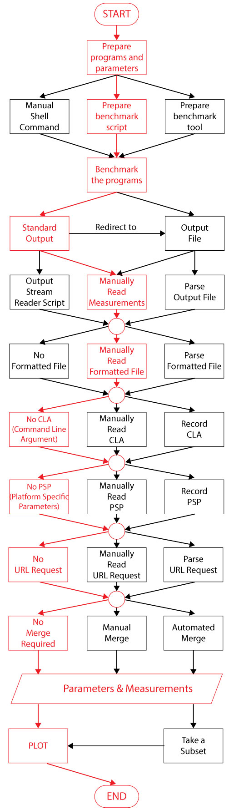

### Scenario 2 (Benchmarking Executable File Manually)

##### Prepare executables and parameters:

Let’s consider, for a specific task, Robin created a C++ executable file called Perfecto. She wants to measure its performance and compare that with two other similar programs — Obsoleto and Coolio — for the exact same task. Both programs have their respective executable file. Let’s consider that for that task, it requires 3 parameters. For example, if the task is to do matrix multiplication, Robin might want the measurements for different matrix sizes (parameters). The executable files take the 3 parameters as command line arguments.

##### Benchmark the programs:

Robin measures the running time using *time* command in shell to print out the measured time in standard output. Now, from a command line window, Robin runs
 each of the executable files separately with different parameters.

    $ time -f "%R" ./perfecto param1 42 param2 3.14 param3 1.61
    0.033
    $ time -f "%R" ./obsoleto param1 42 param2 3.14 param3 1.61
    0.050
    $ time -f "%R" ./coolio param1 42 param2 3.14 param3 1.61
    0.061

##### Manually record measurements:

She manually records measurements similar to 
[Benchmarking Function Manually](https://github.com/sayefsakin/benchmark_charting/blob/master/benchmark_run_scenarios.md#manually-record-measurements).

##### Plot:

She creates plots similar to
[Benchmarking Function Manually](https://github.com/sayefsakin/benchmark_charting/blob/master/benchmark_run_scenarios.md#plot).

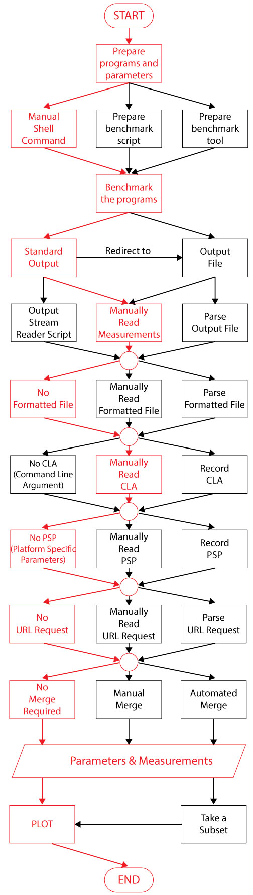

### Scenario 3 (Benchmarking Executable File Automatically)

##### Prepare executables and parameters:

She prepares executables and parameters similar to
[Benchmarking Executable File Manually](https://github.com/sayefsakin/benchmark_charting/blob/master/benchmark_run_scenarios.md#prepare-executables-and-parameters).

##### Prepare a benchmark script for executables:

Robin writes a benchmark script in python. Here she declares 3 arrays (as a list) for the parameters and 3 for the measurement values (as a dictionary for each executable). She initializes the parameter arrays with different values. Then using “Popen” with “PIPE”, she runs the executable and reads the output from the PIPE and assigns measurements to respective list of each executable.

    RUNS = 3
    program_list = ["./perfecto", "./obosoleto", "./coolio"]
    param_name_list = ["params1", "params2", "params3"]
    params = [[42, 24, 34],
              [3.14, 2.52, 55],
              [1.61, 1, 0.61]]
    cmd = ["/usr/bin/time", "-f", "'%R'"]
    a_list = []
    t_cmd = []
    measurements = dict()
    for i in range(RUNS):
        a_list.clear()
        for p in range(len(param_name_list)):
            a_list.append(param_name_list[p])
            a_list.append(str(params[p][i]))
    
        for program in program_list:
            t_cmd.clear()
            t_cmd.extend(cmd)
            t_cmd.append(program)
            t_cmd.extend(a_list)
            proc = Popen(t_cmd, stdout=PIPE, universal_newlines=True)
            measure = proc.stdout.readlines()[0]
            if program not in measurements:
                measurements[program] = list()
            measurements[program].append(measure)

##### Benchmark the programs and record measurements:

She executes the benchmark script. The *measurements* dictionary stores each measurement values for different parameters in *params*.

##### Plot:

Lastly, she generates different charts from the values of the *measurements* dictionary.

### Scenario 4 (Manually Benchmarking Executable File with Output File)

##### Prepare executables and parameters:

She prepares executables and parameters similar to
[Benchmarking Executable File Manually](https://github.com/sayefsakin/benchmark_charting/blob/master/benchmark_run_scenarios.md#prepare-executables-and-parameters).

##### Benchmark the programs and output results to a file:

From a command line window, she runs each of the executable files separately with different parameters and redirects the output into a file (with “>>”). She does this several times and generates an output file.

    $ time -f "%R" ./perfecto param1 42 param2 3.14 param3 1.61 >> outfile
    $ time -f "%R" ./obsoleto param1 42 param2 3.14 param3 1.61 >> outfile
    $ time -f "%R" ./coolio param1 42 param2 3.14 param3 1.61 >> outfile

##### Manually record measurements:

She copies the measurement values from the output file and manually records measurements similar to 
[Benchmarking Function Manually](https://github.com/sayefsakin/benchmark_charting/blob/master/benchmark_run_scenarios.md#manually-record-measurements).

##### Plot:

She creates plots similar to
[Benchmarking Function Manually](https://github.com/sayefsakin/benchmark_charting/blob/master/benchmark_run_scenarios.md#plot).

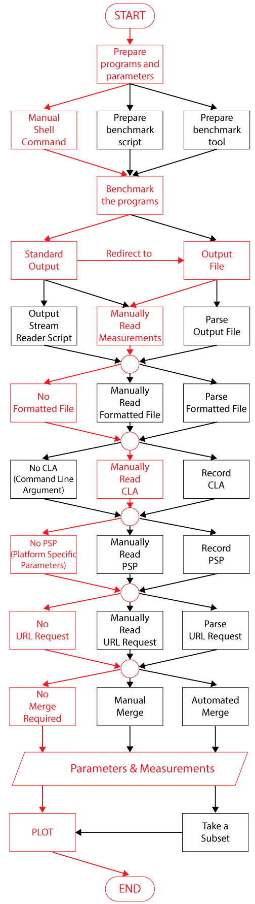

### Scenario 5 (Manually Benchmarking Executable File with Output File Parser)

##### Prepare executables and parameters:

She prepares executables and parameters similar to
[Benchmarking Executable File Manually](https://github.com/sayefsakin/benchmark_charting/blob/master/benchmark_run_scenarios.md#prepare-executables-and-parameters).

##### Benchmark the programs and output results to a file:

She benchmarks the programs and output results to a file similarly to
[Manually Benchmarking Executable File with Output File](https://github.com/sayefsakin/benchmark_charting/blob/master/benchmark_run_scenarios.md#benchmark-the-programs-and-output-results-to-a-file).

##### Record measurements:

Robin writes another program “Record_All_Runs” in python, where she declares 6 arrays ([as a list like this](https://github.com/sayefsakin/benchmark_charting/blob/master/benchmark_run_scenarios.md#manually-record-measurements)). Three of the arrays are for the parameters and 3 for the measurement values. Then she opens the output file (using the “open” function of python), reads each value, and assigns the measurements into respective arrays.

    line_count = 0
    with open("outfile") as fp:
        while True:
            line = fp.readline()
            if not line:
                break
            if line_count % 3 == 0:
                perfecto_time.append(line)
            if line_count % 3 == 1:
                obsoleto_time.append(line)
            if line_count % 3 == 2:
                coolio_time.append(line)
            line_count = line_count + 1

##### Plot:

She creates plots similar to
[Benchmarking Function Manually](https://github.com/sayefsakin/benchmark_charting/blob/master/benchmark_run_scenarios.md#plot).

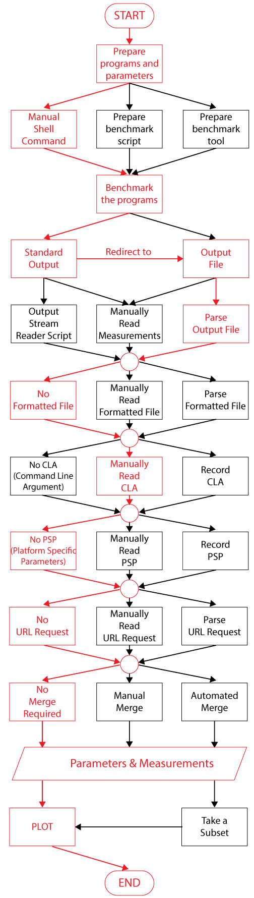

### Scenario 6 (Automatically Benchmarking Executable File with Output File)

##### Prepare executables and parameters:

She prepares executables and parameters similar to
[Benchmarking Executable File Manually](https://github.com/sayefsakin/benchmark_charting/blob/master/benchmark_run_scenarios.md#prepare-executables-and-parameters).

##### Prepare a benchmark script for executables:

Robin writes a benchmark script in python. Here she declares 3 arrays (as a list) for the parameters and inserts them into a dictionary with the parameters names as the key. She initializes the parameter arrays with different values. Then using “Popen” with “PIPE”, she runs the executable and reads the measurement value. She stores the measurement value into the dictionary with the program names as the key. She does these with for all the parameter values with all the executables. Then she writes out the dictionary into a file named *outfile*.

    RUNS = 3
    program_list = ["perfecto", "obosoleto", "coolio"]
    param_name_list = ["params1", "params2", "params3"]
    params_and_measures = dict()
    params_and_measures["params1"] = [1, 2, 5]
    params_and_measures["params2"] = [4, 13, 55]
    params_and_measures["params3"] = [5, 51, 15]
    cmd = ["/usr/bin/time", "-f", "'%R'"]
    a_list = []
    t_cmd = []

    for i in range(RUNS):
        a_list.clear()
        for p in range(len(param_name_list)):
            a_list.append(param_name_list[p])
             a_list.append(str(params_and_measures[param_name_list[p]][i]))
    
        for program in program_list:
            t_cmd.clear()
            t_cmd.extend(cmd)
            t_cmd.append("./" + program)
            t_cmd.extend(a_list)
            proc = Popen(t_cmd, stdout=PIPE, universal_newlines=True)
    
            measure = proc.stdout.readlines()[0]
            if program not in params_and_measures:
                params_and_measures[program] = list()
            params_and_measures[program].append(measure)
    
    target = open('outfile', 'a')
    target.write(str(params_and_measures))
    target.close()

##### Benchmark the programs and record measurements:

Robin executes the benchmark script. Then, she writes another program called “Record_All_Runs” in python, where she opens the *outfile* (using the “open
” function of python), parse the dictionary (using “eval”) and stores that in a variable.

    params_and_measures = eval(open('outfile', 'r').read())

##### Plot:

Lastly, she generates different charts from the values of the *params_and_measures*.

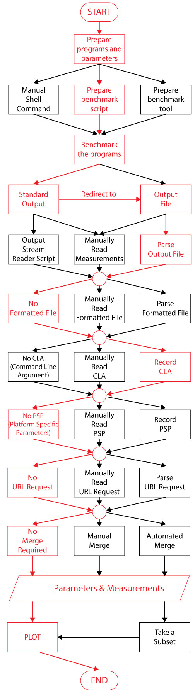

### Scenario 7 (Automatically Benchmarking Executable File with Input and Output File)

##### Prepare executables that read parameters from an input file:

Robin wrote a C++ executable Perfecto and wants to compare its performance with two other similar programs — Obsoleto and Coolio. Now let’s consider there is a configuration file named *infile*, where several parameters along with their values have been declared. The executable files read this configuration file as an input file for the parameters. This configuration file stores the parameter values as a dictionary converted to plaintext string. The executable file finds out the *infile* as follows:

    ./perfecto -i infile

##### Prepare a benchmark script for executables and output to a file:

Robin writes another program “Do_All_Runs” in python. Now, using “Popen” with “PIPE”, she runs the executable and reads the measurement value. She stored the measurement value into a dictionary with the program names as the key. Then she writes out the dictionary into a file named *outfile*.

    RUNS = 3
    program_list = ["perfecto", "obosoleto", "coolio"]
    measures = dict()
    cmd = ["/usr/bin/time", "-f", "'%R'"]
    a_list = ["-i", "infile"]
    t_cmd = []

    for i in range(RUNS):
        for program in program_list:
            t_cmd.clear()
            t_cmd.extend(cmd)
            t_cmd.append("./" + program)
            t_cmd.extend(a_list)
            proc = Popen(t_cmd, stdout=PIPE, universal_newlines=True)

            measure = proc.stdout.readlines()[0]
            if program not in measures:
                measures[program] = list()
            measures[program].append(measure)

    target = open('outfile', 'a')
    target.write(str(measures))
    target.close()

##### Benchmark the programs and record measurements:

Robin executes the benchmark script. Then, she writes another program “Record_All_Runs” in python, where she opens the *outfile* and *infile* (using the
 “open” function of python), parse the dictionary (using “eval”) and stores that in respective variables.

    params = eval(open('infile', 'r').read())
    measures = eval(open('outfile', 'r').read())

##### Plot:

Lastly, she generates different charts by combining the values of the *params* and *measures*.

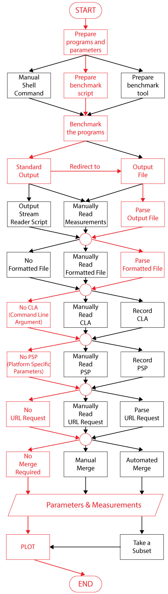

### Scenario 8 (Automatically Benchmarking Executable File with Input File)

##### Prepare executables that read parameters from an input file:

Robin prepares executables that reads parameters from an input file similarly to
[Automatically Benchmarking Executable File with Input and Output File](https://github.com/sayefsakin/benchmark_charting/blob/master/benchmark_run_scenarios.md#prepare-executables-that-read-parameters-from-an-input-file).

##### Prepare a benchmark script for executables:

Robin writes another program “Do_All_Runs” in python. Here she reads the input parameters from *infile* and declares 3 for the measurement values (as a
 dictionary with each executable name as the key). Then using “Popen” with “PIPE”, she runs the executable, reads the output from the PIPE and assigns measurements to respective list of each executable.

    RUNS = 3
    program_list = ["perfecto", "obosoleto", "coolio"]
    params = eval(open('infile', 'r').read())
    measures = dict()
    cmd = ["/usr/bin/time", "-f", "'%R'"]
    a_list = ["-i", "infile"]
    t_cmd = []

    for i in range(RUNS):
        for program in program_list:
            t_cmd.clear()
            t_cmd.extend(cmd)
            t_cmd.append("./" + program)
            t_cmd.extend(a_list)
            proc = Popen(t_cmd, stdout=PIPE, universal_newlines=True)

            measure = proc.stdout.readlines()[0]
            if program not in measures:
                measures[program] = list()
            measures[program].append(measure)

##### Benchmark the program and record measurements:

She runs the “Do_All_Runs” script times and stores the measurements along with parameters into variables *measures* and *params* respectively.

##### Plot:

By combining the variables *params* and *measures*, Robin generates different charts.

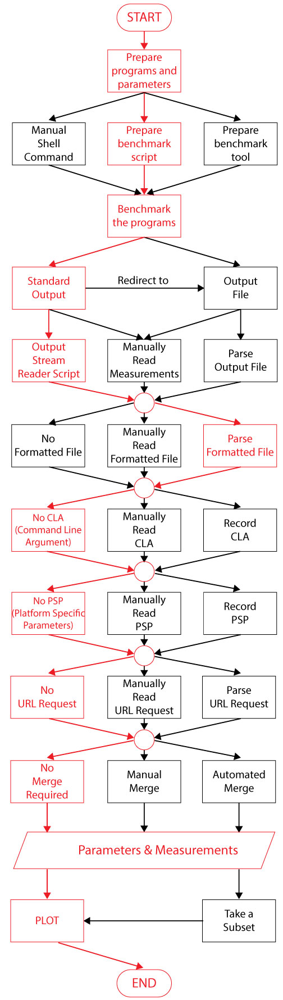

### Scenario 9 (Manually Benchmarking Executable File with Input File)

##### Prepare executables that read parameters from an input file:

Robin prepares executables that reads parameters from an input file similarly to
[Automatically Benchmarking Executable File with Input and Output File](https://github.com/sayefsakin/benchmark_charting/blob/master/benchmark_run_scenarios.md#prepare-executables-that-read-parameters-from-an-input-file).

##### Benchmark the programs:

Robin measures the running time using *time* command in shell to print out the measured time in standard output. Now, from a command line window, Robin runs
 each of the executable files separately with input file *infile*.

    $ time -f "%R" ./perfecto -i infile
    0.033
    $ time -f "%R" ./obsoleto -i infile
    0.050
    $ time -f "%R" ./coolio -i infile
    0.061

##### Manually record measurements:

She manually records measurements similar to 
[Benchmarking Function Manually](https://github.com/sayefsakin/benchmark_charting/blob/master/benchmark_run_scenarios.md#manually-record-measurements).

##### Plot:

She creates plots similar to
[Benchmarking Function Manually](https://github.com/sayefsakin/benchmark_charting/blob/master/benchmark_run_scenarios.md#plot).

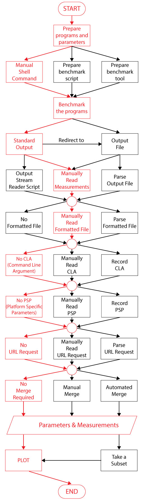

### Scenario 10 (Manually Benchmarking Executable URL)

##### Prepare executable URL and parameters:

Let’s consider, for a specific task, Robin wants to compare performance of 3 exectuable files (Perfecto, Obsoleto, and Coolio) which are being hosted in a cloud platform and can be accessible through a public URL. Now, let’s consider that for that task, it requires 3 parameters. For example, if the task is to do matrix multiplication, Robin might want the measurements for different matrix sizes (parameters). These parameter values can be passed through the GET or POST method.

    http://<base_url>/perfecto?param1=value1&param2=value2&param3=value3

##### Benchmark the programs:

Robin runs the Perfecto executable by calling the URL and passing 3 parameters using the GET method. Let’s consider the URL response is a JSON containing the parameters and measurement values. She also runs Obsoleto and Coolio executables with respective URL requests. She does this several times and calculates multiple measurements for different parameter values.

##### Manually record measurements:

She manually records measurements similar to 
[Benchmarking Function Manually](https://github.com/sayefsakin/benchmark_charting/blob/master/benchmark_run_scenarios.md#manually-record-measurements).

##### Plot:

She creates plots similar to
[Benchmarking Function Manually](https://github.com/sayefsakin/benchmark_charting/blob/master/benchmark_run_scenarios.md#plot).

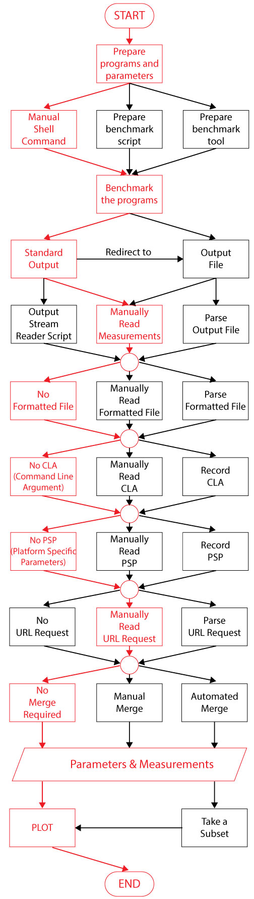

### Scenario 11 (Manually Benchmarking Executable URL with Output File)

##### Prepare executable URL and parameters:

Let’s consider, for a specific task, Robin wants to compare performance of 3 exectuable files (Perfecto, Obsoleto, and Coolio) which are being hosted in a cloud platform and can be accessible through only a public webpage. Now, let’s consider that for that task, it requires 3 parameters. For example, if the task is to do matrix multiplication, Robin might want the measurements for different matrix sizes (parameters). These parameter values can be passed through interactive text fields.

##### Benchmark the programs:

Robin interacts with the webpage to run the executable with different parameters manually. She records the web browser’s inspection log and dumps that into a file named *outfile*.

##### Manually record measurements:

She manually reads the inspection log file, parses specific parameters and measurement values. Now, she writes another program *Record_All_Runs* in python
, where she declares 6 arrays. Three of the arrays are for the parameters and three for the measurement values in 3 functions. Then, she adds the 3 parameter
 values along with the measurements into the respective arrays of the *Record_All_Runs* program by manually typing. For different runs of the benchmark
  script, she adds the values as an additional element of the arrays.

    RUNS = 4
    param1 = [42, 24, 34, 43]
    param2 = [3.14, 2.52, 25.2, 24.1]
    param3 = [1.61, 1, 0.61, 0.42]
    perfecto_time = [25, 62, 21, 20]
    obsoleto_time = [30, 60, 32, 25]
    coolio_time = [35, 70, 36, 47]

##### Plot:

She creates plots similar to
[Benchmarking Function Manually](https://github.com/sayefsakin/benchmark_charting/blob/master/benchmark_run_scenarios.md#plot).

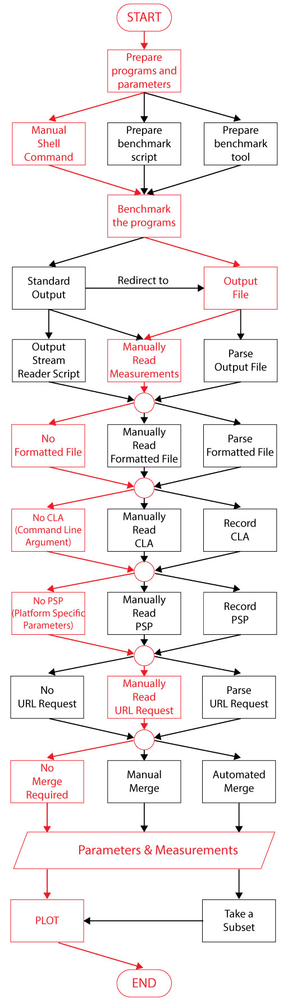

### Scenario 12 (Manually Benchmarking Executable File with Benchmark Tool)

##### Prepare executables and parameters:

She prepares executables and parameters similar to
[Benchmarking Executable File Manually](https://github.com/sayefsakin/benchmark_charting/blob/master/benchmark_run_scenarios.md#prepare-executables-and-parameters).

##### Prepare a benchmark tool:

Now, Robin uses a benchmarking tool which can run a set of executable files a predefined number of times and print out the measurements in the standard output. She manually runs the benchmark program in the command line with different parameter values.

##### Manually record measurements:

She manually records measurements similar to 
[Benchmarking Function Manually](https://github.com/sayefsakin/benchmark_charting/blob/master/benchmark_run_scenarios.md#manually-record-measurements).

##### Plot:

She creates plots similar to
[Benchmarking Function Manually](https://github.com/sayefsakin/benchmark_charting/blob/master/benchmark_run_scenarios.md#plot).

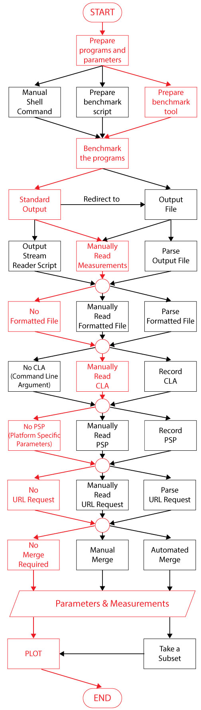

### Scenario 13 (Manually Benchmarking Executable File with Benchmark Tool and Input File)

##### Prepare executables and parameters:

She prepares executables and parameters similar to
[Benchmarking Executable File Manually](https://github.com/sayefsakin/benchmark_charting/blob/master/benchmark_run_scenarios.md#prepare-executables-and-parameters).

##### Prepare a benchmark tool that reads from an input file:

Now, Robin uses a benchmark tool which can read input parameters from a configuration file. The configuration file stores different parameters and the base
 path of the executables with which the benchmark will need to run. Now consider, the configuration file, *infile*, is in JSON format which could be evaluated into python dictionary. The benchmark program prints out the results in standard output.

##### Benchmark the programs:

She manually runs the benchmark program in the command line with different parameter values.

##### Manually record measurements:

She manually records measurements similar to 
[Benchmarking Function Manually](https://github.com/sayefsakin/benchmark_charting/blob/master/benchmark_run_scenarios.md#manually-record-measurements).

##### Plot:

She creates plots similar to
[Benchmarking Function Manually](https://github.com/sayefsakin/benchmark_charting/blob/master/benchmark_run_scenarios.md#plot).

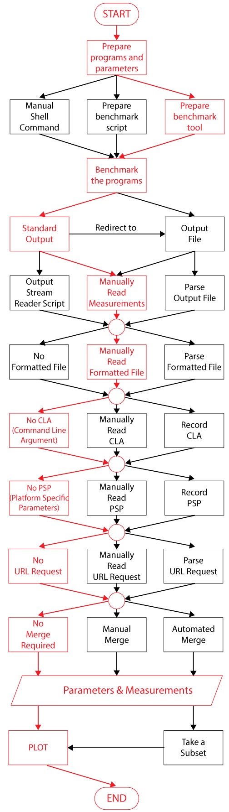

### Scenario 14 (Automatically Benchmarking Executable File with Benchmark Tool and Input File)

##### Prepare executables and parameters:

She prepares executables and parameters similar to
[Benchmarking Executable File Manually](https://github.com/sayefsakin/benchmark_charting/blob/master/benchmark_run_scenarios.md#prepare-executables-and-parameters).

##### Prepare a benchmark tool that reads from an input file:

She prepares a benchmark tool that reads from an input file similarly to
[Manually Benchmarking Executable File with Benchmark Tool and Input File](https://github.com/sayefsakin/benchmark_charting/blob/master/benchmark_run_scenarios.md#prepare-a-benchmark-tool-that-reads-from-an-input-file).

##### Prepare a benchmark script for benchmark tool:

Robin writes another program “Do_All_Runs” in python, where she declares 6 arrays. Three of the arrays are for the parameters and 2 for the measurement values. She opens the configuration file using “open” function, reads the parameters, and update the respective array. Then she runs the benchmark program using “Popepn” and with “PIPE” she reads out the output of the program. She parses the output and updates respective measurement array.

For example, if she uses [*blazemark*](https://bitbucket.org/blaze-lib/blaze/wiki/Blazemark) for benchmarking, its output should look like this:

      N=50, steps=4966379
         Blaze       = 1        (2.29648)

She writes a python script to run the benchmark automatically and parse the output.

    blazeLineParser = re.compile(r'\s+Blaze\s+=\s+\d+\s+\((\d*\.?\d*)\)')
    cmd = ["/home/sayefsakin/blaze-3.8/blazemark/bin/complex1", "-only-blaze"]
    proc = Popen(cmd, stdout=PIPE, universal_newlines=True)
    for line in proc.stdout.readlines():
        blazeLineMatch = blazeLineParser.match(line)
        if blazeLineMatch is not None:
            running_time = blazeLineMatch.group(1)

##### Benchmark the program and record measurements:

She runs the “Do_All_Runs” script times and stores the measurements along with parameters into respective variables.

##### Plot:

Lastly, she generates different charts with the measurements and parameters.

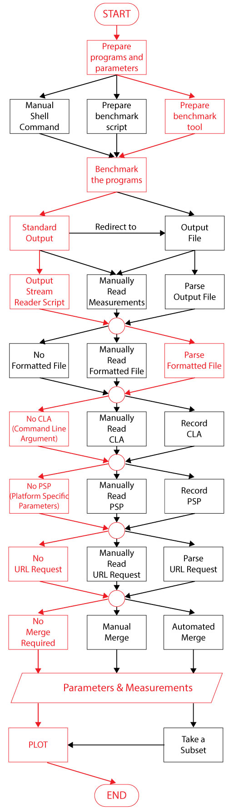

### Scenario 15 (Automatically Benchmarking Executable File with Benchmark Tool, Input and Output File)

##### Prepare executables and parameters:

She prepares executables and parameters similar to
[Benchmarking Executable File Manually](https://github.com/sayefsakin/benchmark_charting/blob/master/benchmark_run_scenarios.md#prepare-executables-and-parameters).

##### Prepare a benchmark tool that reads from an input file:

She prepares a benchmark tool that reads from an input file similarly to
[Manually Benchmarking Executable File with Benchmark Tool and Input File](https://github.com/sayefsakin/benchmark_charting/blob/master/benchmark_run_scenarios.md#prepare-a-benchmark-tool-that-reads-from-an-input-file).

##### Benchmark the programs and output results to a file:

From a command line window, she runs the benchmark tool executable and redirects the output into a file (with “>>”). Let’s consider the benchmark tool prints out its output as JSON format which could be parsed into python dictionary. For example, if she uses [*blazemark ](https://bitbucket.org/blaze-lib/blaze/wiki/Blazemark)*for benchmarking, she could redirect it’s output as follows:

    $ ./complex1 -only-blaze >> outfile

##### Record measurements:

She writes another program “Record_All_Runs” in python, where she opens the *outfile* and *infile* (using the “open” function of python), parse the
 dictionary (using “eval”) and stores that in respective variables.

    params = eval(open('infile', 'r').read())
    measures = eval(open('outfile', 'r').read())

##### Plot:

Lastly, she generates different charts by combining the values of the *params* and *measures*.

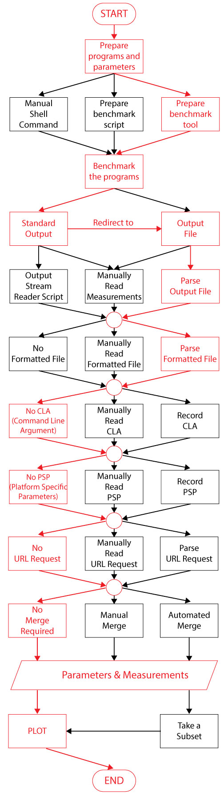

### Scenario 16 (Manually Benchmark in Multiple Machines)

##### Prepare executables and parameters:

She prepares executables and parameters similar to
[Benchmarking Executable File Manually](https://github.com/sayefsakin/benchmark_charting/blob/master/benchmark_run_scenarios.md#prepare-executables-and-parameters).

##### Prepare a benchmark tool that reads from an input file:

She prepares a benchmark tool that reads from an input file similarly to
[Manually Benchmarking Executable File with Benchmark Tool and Input File](https://github.com/sayefsakin/benchmark_charting/blob/master/benchmark_run_scenarios.md#prepare-a-benchmark-tool-that-reads-from-an-input-file).

##### Benchmark the programs in remote machine and output results to a file:

Robin log-in to remote machine and from a command line window, she runs the benchmark tool executable and redirects the output into a file (with “>>”). Let’s consider the benchmark tool prints out its output as JSON format which could be parsed into python dictionary.

##### Move the input and outfile to local machine:

Robin copies the input configuration and output files from remote machines, moves them to a local machine, combines them and creates a single input
 configuration and output file. Then, she writes another program “Parser” in python, where she opens the *outfile* and *infile* (using the “open” function
  of python), parse the dictionary (using “eval”) and stores that in respective variables.

    params = eval(open('infile', 'r').read())
    measures = eval(open('outfile', 'r').read())

##### Plot:

Lastly, she generates different charts by combining the values of the *params* and *measures*.

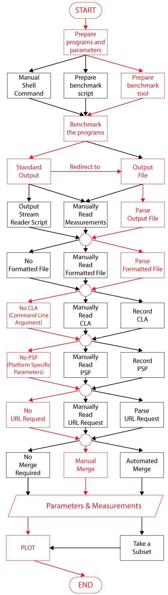

### Scenario 17 (Automatically Benchmark in Multiple Machines)

##### Prepare executables and parameters:

She prepares executables and parameters similar to
[Benchmarking Executable File Manually](https://github.com/sayefsakin/benchmark_charting/blob/master/benchmark_run_scenarios.md#prepare-executables-and-parameters).

##### Prepare a benchmark tool that reads from an input file:

She prepares a benchmark tool that reads from an input file similarly to
[Manually Benchmarking Executable File with Benchmark Tool and Input File](https://github.com/sayefsakin/benchmark_charting/blob/master/benchmark_run_scenarios.md#prepare-a-benchmark-tool-that-reads-from-an-input-file).

##### Prepare a benchmark script:

Robin writes a shell script to run the benchmark tool in multiple machines, generates the output files, copies the output files (using “scp”) to her local machine, and combines them.

    $ ssh machine1
    $ ./complex1 -only-blaze >> outfile
    $ exit
    $ ssh machine2
    $ ./complex1 -only-blaze >> outfile
    $ exit
    $ scp machine1:~/outfile outfile1
    $ scp machien2:~/outfile outfile2
    $ scp machine1:~/infile infile1
    $ scp machien2:~/infile infile2
    $ cat outfile1 outfil2 > outfile
    $ cat infile1 infile2 > infile

##### Benchmark the programs and record measurements:

She benchmarks the programs and record measurements similarly to
[Automatically Benchmarking Executable File with Input and Output File](https://github.com/sayefsakin/benchmark_charting/blob/master/benchmark_run_scenarios.md#benchmark-the-programs-and-record-measurements-2).

##### Plot:

She creates plots similarly to
[Automatically Benchmarking Executable File with Input and Output File](https://github.com/sayefsakin/benchmark_charting/blob/master/benchmark_run_scenarios.md#plot-7).

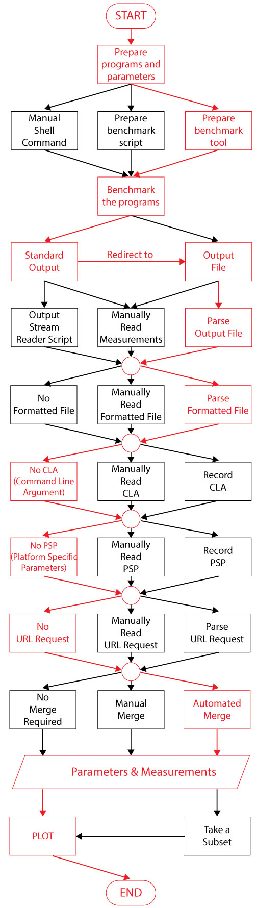

### Scenario 18 (Automatically Benchmark in Multiple Machines with Multiple Benchmark Tools and Input Files)

##### Prepare executables and parameters:

She prepares executables and parameters similar to
[Benchmarking Executable File Manually](https://github.com/sayefsakin/benchmark_charting/blob/master/benchmark_run_scenarios.md#prepare-executables-and-parameters).

##### Prepare multiple benchmark tools that reads from an input file:

She prepares a set of benchmark tools that reads from an input file similarly to
[Manually Benchmarking Executable File with Benchmark Tool and Input File](https://github.com/sayefsakin/benchmark_charting/blob/master/benchmark_run_scenarios.md#prepare-a-benchmark-tool-that-reads-from-an-input-file).

##### Prepare a benchmark script:

Robin writes a shell script to run the benchmark tools in multiple machines, generates the output files, copies the output files (using “scp”) to her local machine, and combines them.

    $ ssh machine1
    $ ./complex1 -only-blaze >> outfile
    $ exit
    $ ssh machine2
    $ ./complex1 >> outfile
    $ exit
    $ scp machine1:~/outfile outfile1
    $ scp machien2:~/outfile outfile2
    $ scp machine1:~/infile infile1
    $ scp machien2:~/infile infile2
    $ cat outfile1 outfil2 > outfile
    $ cat infile1 infile2 > infile

##### Benchmark the programs and record measurements:

She benchmarks the programs and record measurements similarly to
[Automatically Benchmarking Executable File with Input and Output File](https://github.com/sayefsakin/benchmark_charting/blob/master/benchmark_run_scenarios.md#benchmark-the-programs-and-record-measurements-2).

##### Plot:

She creates plots similarly to
[Automatically Benchmarking Executable File with Input and Output File](https://github.com/sayefsakin/benchmark_charting/blob/master/benchmark_run_scenarios.md#plot-7).

### Scenario 19 (Same parameter values and Same measurement type(s))

##### Prepare output file from a previous run:

Robin does any of the scenarios 0–18, stores the measurements and parameters in a file, called *outfile*.

##### Benchmark the programs and record measurements:

She reads the *outfile* file and reruns the benchmark with the exact same parameters and generates new values for the same measurement type(s). She stores
 the new measurement values in the *outfile*.

##### Plot:

She creates different plots from *outfile*.

### Scenario 20 (Same parameter values and new measurement type(s))

##### Prepare output file from a previous run:

Robin does any of the scenarios 0–18, stores the measurements and parameters in a file, called *outfile*.

##### Benchmark the programs and record measurements:

She reads the *outfile* and reruns the benchmark with the exact same parameters. This time Robin measures a different thing. For example, for the matrix
 multiplication program, previously she measured the execution time. Now, she could measure CPU cycles in MFLOPS. Then, She stores the values for the new measurement type(s) into the *outfile*.

##### Plot:

She creates different plots from *outfile*.

### Scenario 21 (Additional parameter values and same measurement type(s))

##### Prepare output file from a previous run:

Robin does any of the scenarios 0–18, stores the measurements and parameters in a file, called *outfile*.

##### Benchmark the programs and record measurements:

She reads the *outfile*, reruns the benchmark with some additional parameter values, and gets new measurements. She stores the parameters and measurements (along with the additional ones) in the *outfile*. For example, for matrix multiplication, if she take matrix size 50, 100, 150 in a previous benchmark run, now, she runs the benchmark with matrix size 50, 100, 150, 200, 250, 300.

##### Plot:

She creates different plots from *outfile*.

### Scenario 22 (New parameter type(s) and same measurement type(s))

##### Prepare output file from a previous run:

Robin does any of the scenarios 0–18, stores the measurements and parameters in a file, called *outfile*.

##### Benchmark the programs and record measurements:

She reads the *outfile*, reruns the benchmark with the some additional new parameter types. She takes the same exact measurement as before and stores the
 parameters (along with the additional ones) and measurements in the *outfile*. For example, previously, if she considered 3 parameters as param1, param2, param3. Now, she considers additional 2 parameters — param4 and param5.

##### Plot:

She creates different plots from *outfile*.

### Scenario 23 (New parameter and measurement type(s))

##### Prepare output file from a previous run:

Robin does any of the scenarios 0–18, stores the measurements and parameters in a file, called *outfile*.

##### Benchmark the programs and record measurements:

She reads the *outfile* and reruns the benchmark with the some additional new parameter types. She takes the same exact measurement as before with an
 additional measurement type. Then she stores all the parameters and measurements in the *outfile*. For example, if for a previous benchmark run, she measured only execution time for param1, param2, param3. Now, she wants to measure execution time and CPU cycle for param1, param2, param3, param4, param5.

##### Plot:

She creates different plots from *outfile*.

### Scenario 24 (Subset of the data)

##### Prepare output file from a previous run:

Robin does any of the scenarios 0–18, store the measurements and parameters in a file, called *outfile*.

##### Take a subset of the data:

She reads the outfile and filters out only a subset of the data with a script. For example, with the following script, Robin filters out all the parameters and measurement in which the value of “param1” is greater than 10.

    params = eval(open('infile', 'r').read())
    measures = eval(open('outfile', 'r').read())
    new_params = dict()
    new_measures = dict()
    for key in params:
        new_params[key] = list()

    for i, val in enumerate(params["params1"]):
        if val > 10:
            for key in params:
                new_params[key].append(params[key][i])
            for key in measures:
                new_measures[key].append(measures[key][i])

##### Plot:

Lastly, she generates different charts by combining the values of the *new_params* and *new_measures*.

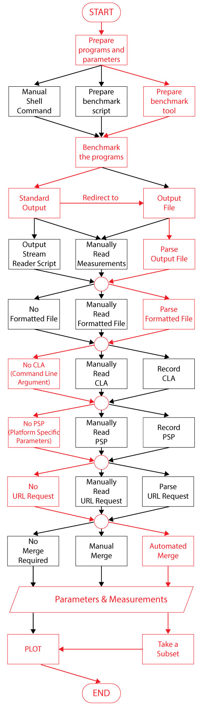

**Disclaimer**: Robin is a fictitious person. Perfecto, Obsoleto, and Coolio are imaginary program names.

**Scenario Keys**

**User Action**: Manual, Automatic

**Runnable**: Function, Library, Executable File, URL

**Benchmark**: Benchmark script, Benchmark tool

**Input Types**: File, Command line argument, Inline variables, System information, Environment Variables

**Parameters and Measurements**: Same value, Additional value, Same type, Additional type, Subset of the type, Subset of the value
